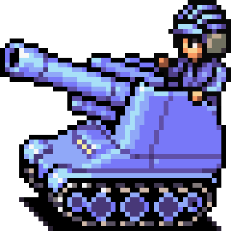

# advance-wars-colorscripts

An Advance Wars sprite in your terminal, every time you open a shell.

I wanted [pokemon-colorscripts][pcs] with Advance Wars units instead. While I
was in there I added support for the real terminal graphics protocols, so on
kitty or a recent Windows Terminal you get actual pixels instead of coloured
block characters.



Blue Moon artillery, scaled 8x so you can actually see it. 238 sprites total.

## Install

```sh
git clone https://github.com/XoanOuteiro/advance-wars-colorscripts \
    ~/.local/share/advance-wars-colorscripts
```

Add this to your shell rc:

```sh
~/.local/share/advance-wars-colorscripts/spritescript.sh
```

Nothing to build and no dependencies. The sprites are text files, `cat` puts
them on screen, and the runtime is POSIX sh. The filename is `spritescript.sh`
because I named it before I named the repo.

## Usage

```sh
spritescript.sh                     # random
spritescript.sh -n recon            # a recon, random army
spritescript.sh -n black-hole-sub   # that one
spritescript.sh --army blue-moon    # random Blue Moon unit
spritescript.sh -l                  # list everything
spritescript.sh -a                  # animate, ctrl-c to stop
```

`export SPRITESCRIPT_ARMY=green-earth` if you always want the same army. Fish
wants `set -Ux` instead of `export`.

Don't put `-a` in your shell rc unless you want your prompt held hostage.

## The sprites

Armies are orange-star, blue-moon, green-earth, yellow-comet and black-hole.
Every name is `<army>-<unit>`. A bare unit name means any army.

Three sets of art are available. The default is the 16px map sprites, 26 units
per army, and 95 of those 130 have a two-frame idle. `-r battle` is the
full-size battle art at 19 units per army. `-r gba` is AW1-era battle art,
Orange Star only, 10 units.

```sh
spritescript.sh -r battle -n blue-moon-artillery
spritescript.sh -r gba -n mdtank
```

Map units:

```
infantry mech apc oozium recon tank mdtank neotank megatank artillery
rockets piperunner missiles antiair tcopter bcopter fighter bomber
stealth blackbomb blackboat lander cruiser sub battleship carrier
```

Only 19 of those exist in the battle sheets: infantry, mech, recon, apc, tank,
mdtank, antiair, artillery, neotank, rockets, missiles, tcopter, bcopter,
bomber, fighter, lander, cruiser, sub and battleship. Three more components are
unidentified and sit under `-alt` names, rather than a name I'd be guessing at.

Battle sprites are about 118 columns wide in the fallback renderer. Widen your
terminal, or set `SPRITESCRIPT_BLOCKS=hybrid` to halve that.

## Renderer detection

Matching `$TERM_PROGRAM` against a list of terminal names is guesswork, so the
capabilities come from a direct query instead. Three of them go out in a single
write: a kitty graphics probe, XTVERSION, and DA1.

DA1 gets a reply from every terminal, so that response marks the end of the
read, and there's no fixed timeout for terminals that stay silent on the other
two. Worst case is 0.4 seconds on a terminal that replies to nothing, once,
after which the result is cached in `$XDG_CACHE_HOME/spritescript/`. For the
result of all this, use `--probe`.

The same art ships five times over: `kitty`, `iterm`, `sixel`, `blocks` for
half-block characters, and `wide` for solid background cells with no glyphs at
all. `wide` is the fallback default because subpixel antialiasing puts colour
fringes on glyph edges and that looks awful on pixel art. Background fills
never reach the font rasteriser, so no fringing.

A missing set falls back through the character-based ones. Never upward into a
protocol the terminal never advertised, since the result there is escape codes
all over your screen.

## Environment

| | |
|---|---|
| `SPRITESCRIPT_ARMY` | only pick from this army |
| `SPRITESCRIPT_DIR` | asset root, overridden by `-r` and `-d` |
| `SPRITESCRIPT_SET` | force kitty, iterm, sixel, blocks or wide |
| `SPRITESCRIPT_BLOCKS` | what `blocks` means, `wide` or `hybrid` |
| `SPRITESCRIPT_NO_CACHE` | probe every time |

## Caveats

Fractional `sleep` isn't POSIX, though GNU and BSD both accept it, so animation
is fine on Linux and macOS. Sixel doesn't survive tmux. Sixel transparency is
1-bit, which is irrelevant for pixel art.

## Credits

The idea is [pokemon-colorscripts][pcs] by Phoney Badger. None of its code is
here.

The sprites are Advance Wars art, © Nintendo and Intelligent Systems, ripped
and recoloured by the community. Map and battle sets come from
[AWBW](https://awbw.amarriner.com/), and the GBA set is a [Spriters
Resource](https://www.spriters-resource.com/) rip by Rogultgot.

None of the sheets are labelled, so I named every unit by eye off a contact
sheet. If one of them is wrong, open an issue.

## Licence

The code is MIT, see [LICENSE](LICENSE). That covers `spritescript.sh` and this
file. The sprites aren't covered, because they aren't mine to license. If that
matters for what you're doing, delete the `assets*` directories and the rest
still runs.

[pcs]: https://gitlab.com/phoneybadger/pokemon-colorscripts
